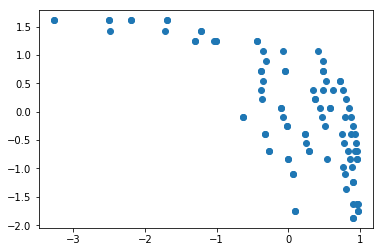
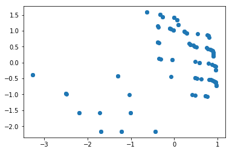
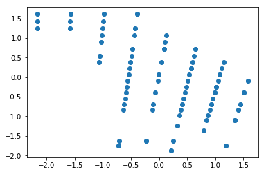

# Traza del algoritmo


***José Rodríguez Maldonado ***
```54104045-H```


Para esta parte opcional lo que vamos a hacer será seguir la traza de los pasos realizados para generar los diferentes ficheros, explicando paso a paso que es lo que hace el algoritmo.

Empezamos como es normal preguntado por el fichero que queremos leer. En mi caso solo hay que pasarle el identificador de los dos ficheros tanto el FUN. como el VAR. puesto que he visto que tienen la misma estructura de nombre me he basado en eso para leerlos.

Para evitar errores, pasa siempre las cadenas a mayúsuclas. Y después pasamos directamente a abrir tanto el fichero *VAR.id.tsv* como el *FUN.id.tsv*.


```python
id = 'bb11001'
id = id.upper()
archivo_FUN = open('FUN.' + id + '.tsv', 'r')
archivo_VAR = open('VAR.' + id + '.tsv', 'r')
lista_fun = archivo_FUN.readlines()
lista_var = archivo_VAR.readlines()
print(id)
```

    BB11001


Una vez abiertos los diferentes archivos, pasamos a generar listas de valores de las diferentes medidas.


```python
# Here we are generating the different lists to store the different measures.
strike = []
tc = []
sp = []
# Here we iterate over the different lines.
for linea in lista_fun:
    # Here we split the lines into the different lists of parameters.
    vector = linea.split('\t')
    strike.append(vector[0])
    tc.append(vector[1])
    sp.append(vector[2])
```

Lo siguiente que vamos a hacer será generar y abrir los ficheros donde vamos a mostrar los resultados.


```python
 # We open the different result directories
f1 = open("results/Best_strike_seq.txt", "w")
f2 = open("results/Best_tc_seq.txt", "w")
f3 = open("results/Best_sp_seq.txt", "w")
f4 = open("results/Best_strike_value.txt", "w")
f5 = open("results/Best_tc_value.txt", "w")
f6 = open("results/Best_sp_value.txt", "w")
```

Llegados a este punto ya tenemos todo preparado y podemos pasar a calcular los máximos y las posiciones en las que se encuentran. En caso de estar repetidos cogerá exclusivamente un valor.


```python
import operator
# Calculate the maximum values for each parameter
index, value = max(enumerate(strike), key=operator.itemgetter(1))
index1, value1 = max(enumerate(tc), key=operator.itemgetter(1))
index2, value2 = max(enumerate(sp), key=operator.itemgetter(1))
print('Indice: ', index,' Valor: ',value)
print('Indice: ',index1,' Valor: ',value1)
print('Indice: ',index2,' Valor: ',value2)
```

    Indice:  0  Valor:  3.0025074720027796
    Indice:  2  Valor:  6.796116504854369
    Indice:  1  Valor:  92.74193548387096


Teniendo estos resultados ya podemos escribir la mitad de los archivos generados.


```python
 # Here we calculate the mean values
st = 0
cps = 0
spp = 0
for strik in strike:
    st = st + float(strik)
mean_strike = st / len(strike)

for tci in tc:
    cps = cps + float(tci)
mean_tc = cps / len(tc)

for sps in sp:
    spp = spp + float(sps)
mean_sp = spp / len(sp)

# Here we are writting the score values
f4.write(
    'Strike: ' + strike[index] + ' Mean: ' + str(mean_strike) + '\n TC: ' + tc[index] + ' Mean: ' + str(mean_tc)
    + '\n SP: ' + sp[index] + ' Mean: ' + str(mean_sp))
f5.write(
    'Strike: ' + strike[index1] + ' Mean: ' + str(mean_strike) + '\n TC: ' + tc[index1] + ' Mean: ' + str(mean_tc)
    + '\n SP: ' + sp[index1] + ' Mean: ' + str(mean_sp))
f6.write(
    'Strike: ' + strike[index2] + ' Mean: ' + str(mean_strike) + '\n TC: ' + tc[index2] + ' Mean: ' + str(
    mean_tc) + '\n SP: ' + sp[index2] + ' Mean: ' + str(mean_sp))
```


    145


Ahora solo resta añadir a los ficheros los resultados de los alineamientos que hemos encontrado. Para ello contaremos el numero de veces que aparece a lo largo de los ficheros ```>1aab\n```. Esto lo haremos para buscar los diferentes índices y guardar así los alineamientos deseados.


```python
# Write the different values (sequences)
count = 0
for i in range(0, len(lista_var)):
    if str(lista_var[i]) == '>1aab_\n':
        if count == index:
            for j in range(i, i + 8):
                f1.write(lista_var[j])
                count = 0
                break
        else:
            count = count + 1
for j in range(0, len(lista_var)):
    if str(lista_var[j]) == '>1aab_\n':
        if count == index1:
            for k in range(j, j + 8):
                f2.write(lista_var[k])
                count = 0
                break
        else:
            count = count + 1
for p in range(0, len(lista_var)):
    if str(lista_var[p]) == '>1aab_\n':
        if count == index2:
            for j in range(p, p + 8):
                f3.write(lista_var[j])
                break
        else:
            count = count + 1
```

Además para este ejercicio he tratado de visualizar los datos con el objetivo de encontrar la curva de compromiso en la que se mueven los diferentes datos. El resultado obtenido se puede visualizar usando el codigo poniendo el segundo parámetro que se le pasa a la clase ```true```.


```python
from sklearn import preprocessing
import matplotlib.pyplot as plt
# Normalizamos los datos
strike_norm = preprocessing.scale(strike)
tc_norm = preprocessing.scale(tc)
cp_norm = preprocessing.scale(sp)
# Mostramos en la gráfica
plt.plot(strike_norm, cp_norm, 'o')
plt.show()
```





Como se puede apreciar la disminución en el eje Y es proporcional al aumento en el eje X. Las desviaciones que se aprecian son ocasionadas por el tercer parámtro TS. Aunque se aprecia que es importante, se aprecia que las desviaciones que aporta son pequeñas a diferencia de los otros casos.


```python
plt.plot(strike_norm, tc_norm, 'o')
plt.show()
plt.plot(tc_norm, cp_norm, 'o')
plt.show()
```








También tenemos otra función que nos va a calcular cual es la medida del menor para cada uno. La única diferencia radica en que en vez de calcular el máximo, reutilizaremos el mismo código pero con el mínimo.


```python
 # Calculate the minimum values for each parameter
indexmin, valuemin = min(enumerate(strike), key=operator.itemgetter(1))
indexmin1, valuemin1 = min(enumerate(tc), key=operator.itemgetter(1))
indexmin2, valuemin2 = min(enumerate(sp), key=operator.itemgetter(1))
print('Indice: ', indexmin,' Valor: ',valuemin)
print('Indice: ',indexmin1,' Valor: ',valuemin1)
print('Indice: ',indexmin2,' Valor: ',valuemin2)
```

    Indice:  1  Valor:  1.0129183317003478
    Indice:  4  Valor:  0.0
    Indice:  5  Valor:  74.35344827586206


## Extensión: Cambio de enunciado

Vuelvo a subir mi trabajo con el nuevo cambio de enunciado. Que es añadir el valor de las medias correspondientes. Para ello lo que hecho ha sido implementar al principio del código una función que utilizo para calcular el valor de las medias. Y el resto ha sido solo, sobre el esquema que tenía ya hecho, calcular el valor de las medias y reutilizando el codigo que ya tenía lo he cambiado levemente para adecuarlo a las medianas.


```python
def median(data_list):
    data = sorted(data_list)
    index = len(data_list)//2
    value = data[len(data)//2]
    return index, value
```

Para utilizar esta función lo haremos de la siguiente forma;


```python
res, ind = median(sp)
```

Una vez tenemos claro el valor y el índice, lo que haremos será igual que antes, guardar en el fichero el alineamiento que queramos y printear los datos


```python

```


    ---------------------------------------------------------------------------

    NameError                                 Traceback (most recent call last)

    <ipython-input-16-a24cc00d627f> in <module>()
          3         if count == res:
          4             for j in range(p, p + 8):
    ----> 5                 fmedian.write(lista_var[j])
          6             break
          7         else:


    NameError: name 'fmedian' is not defined


También he aprovechado para refactorizar un poco el código incluyendo la función ```print_Align``` que utilizaré para escribir en los ficheros los alineamientos.


```python
def print_Align(lista_var, fich_escrib, index):
    count = 0
    for i in range(0, len(lista_var)):
        if str(lista_var[i]) == '>1aab_\n':
            if count == index:
                for j in range(i, i + 8):
                    fich_escrib.write(lista_var[j])
                break
            else:
                count = count + 1
    print("File: " + str(fich_escrib) + " writted.")
```
